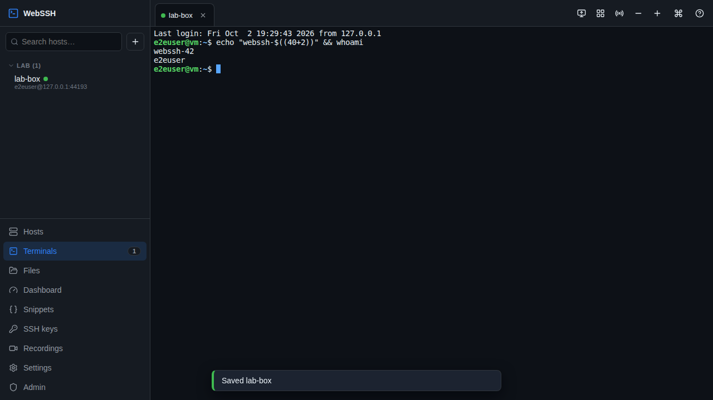
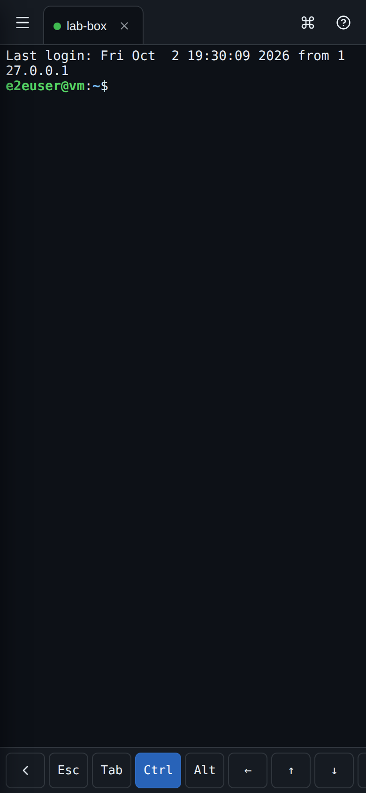
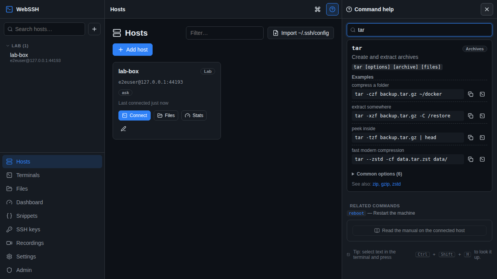
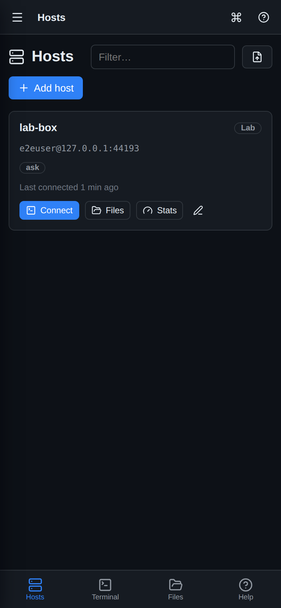

# WebSSH — your homelab in a browser tab

A self-hosted, security-first web SSH console for your homelab. Open **https://webssh.lucafchala.com** on your laptop or phone and you get real terminals, a file manager, live host dashboards, Docker/systemd control, command help, and an optional AI assistant — without opening a single port on your router.

**It costs $0 to run.** It runs on your own hardware, reaches the internet through Cloudflare's free tier (Tunnel + Access + DNS), and is built entirely from open-source parts. The AI assistant is optional; it can use [Ollama](https://ollama.com) (free and local) or a paid API such as Claude.

| Desktop | Phone |
|---|---|
|  |  |
|  |  |

---

## Start here

| You want to… | Read |
|---|---|
| **Install it on your homelab** (step by step, ~20 min) | [docs/INSTALL.md](docs/INSTALL.md) |
| Have an AI agent on your server do the install for you | [HOMELAB_AGENT_PROMPT.md](HOMELAB_AGENT_PROMPT.md) — paste it into Claude Code (or similar) running on the homelab |
| Set up Cloudflare Tunnel + Access (free) | [docs/CLOUDFLARE.md](docs/CLOUDFLARE.md) |
| Learn every feature (terminals, phone use, files, AI…) | [docs/USER_GUIDE.md](docs/USER_GUIDE.md) |
| Understand the security model / harden further | [SECURITY.md](SECURITY.md) |
| Develop on this repo (humans or AI agents) | [AGENTS.md](AGENTS.md) and [docs/ARCHITECTURE.md](docs/ARCHITECTURE.md) |

## Features

**Terminals**
- Full xterm.js terminals: 256-colour and truecolour, Unicode, clickable links, scrollback search, WebGL rendering
- Tabs, a **split/grid view**, and **broadcast input** to type into several hosts at once
- **Sessions survive disconnects.** Close the laptop and carry on from your phone: the shell keeps running on the server and re-attaches with the screen restored (server-side headless terminal)
- **Phone-friendly:** an extra-keys bar (Esc, Tab, sticky Ctrl/Alt, arrows, F-keys, symbols), the keyboard never covers the prompt, and it installs as an app (PWA)
- Jump hosts (bastions), startup commands (e.g. `tmux new -As main`), host colours, groups, tags and favourites
- Optional **session recording** (asciicast v2) with a built-in player
- Wake-on-LAN, `~/.ssh/config` import, and `ssh-copy-id`-style key install

**Homelab control**
- **SFTP file manager**: browse, drag-and-drop upload with progress, download (folders as `.tar.gz`), rename/chmod/delete, and an in-browser code editor with syntax highlighting, conflict detection and optional `sudo` save
- **Live dashboard** per host: CPU, memory, load, disks, network rates, temperatures, top processes
- **Docker**: containers grouped by compose project, start/stop/restart, logs, shell into a container
- **systemd**: services (running/failed/all), start/stop/restart/enable, journal logs
- Pending **package updates** (apt/dnf/pacman/apk) plus one-click "upgrade in terminal"; reboot and shutdown with typed confirmation
- **Snippets** with `{{variables}}`: insert into a terminal, or run on many hosts at once and compare the outputs

**Command help, local-first**
- An offline guide to 130+ homelab commands (Docker, ZFS, Proxmox, systemd, networking, firewalls…), 40+ task recipes ("disk is full", "what is using port 80", "update compose containers"), and keyboard cheat sheets (tmux, vim, nano, less, bash)
- Falls back to free [tldr-pages](https://tldr.sh) and to the real `man` page **on your host**. The AI is only offered when none of these can answer.

**AI assistant (optional)**
- **Ask** questions, generate a **command** from a plain-English description, or use **Agent** mode, where the AI investigates and fixes things on the host you're connected to
- **Nothing runs without your approval.** Every proposed command shows a risk badge (read-only / changes state / dangerous). Dangerous commands (`rm -rf /`, `mkfs`, reboot, firewall flushes…) need a typed confirmation, and everything is audit-logged.
- Providers: **Ollama** (free, local), **Claude** (Anthropic API), or any OpenAI-compatible endpoint

**Security** (details in [SECURITY.md](SECURITY.md))
- Cloudflare Tunnel (no inbound ports) plus Cloudflare Access in front, with the Access JWT verified by the app
- App login: scrypt-hashed passwords, **mandatory 2FA** (TOTP or passkeys / Face ID / YubiKey), recovery codes, lockouts, rate limits
- Saved SSH passwords, private keys, TOTP secrets and API keys are encrypted with **AES-256-GCM** under your master key; private keys can never be downloaded again
- Host keys are pinned on first use (TOFU) and a changed key blocks the connection
- Strict CSP, CSRF tokens, origin checks, `__Host-` cookies, an IP allowlist, an SSH target allowlist, and a full **audit log**
- Hardened container: non-root, read-only filesystem, all capabilities dropped

## Quick start (Docker + Cloudflare)

```bash
git clone https://github.com/lucafchala/webssh.lucafchala.com.git webssh && cd webssh
cp .env.example .env && chmod 600 .env
sed -i "s|^MASTER_KEY=.*|MASTER_KEY=$(openssl rand -base64 32)|" .env
# Create the tunnel + Access app (or follow docs/CLOUDFLARE.md in the dashboard):
CF_API_TOKEN=… CF_ACCOUNT_ID=… ./deploy/cloudflare-setup.sh --hostname webssh.lucafchala.com --email you@example.com
docker compose up -d --build
docker compose logs webssh | grep -A3 "setup token"     # one-time token for the first admin
```

Open `https://webssh.lucafchala.com`, sign in through Cloudflare Access, then create the admin account with the setup token and enrol 2FA. The full walkthrough is in [docs/INSTALL.md](docs/INSTALL.md).

## Tech stack

Node.js 22 · Fastify 5 · [ssh2](https://github.com/mscdex/ssh2) · SQLite (`node:sqlite`, no native addons) · xterm.js 6 (+ headless for session state) · Preact + Signals · Vite · CodeMirror 6 · SimpleWebAuthn · Anthropic SDK · Vitest + Playwright. Every dependency is free and open source.

## Development

```bash
npm install
npm run dev           # API on :8080 + Vite on :5173 (set PUBLIC_URL=http://localhost:5173)
npm test              # unit + integration tests (integration needs a local sshd; run as root for PTYs)
npm run test:e2e      # Playwright browser tests (needs a prior `npm run build`)
npm run typecheck && npm run build
```

See [AGENTS.md](AGENTS.md) for the project layout, conventions, and the security rules every change must keep.

## License

MIT. See [LICENSE](LICENSE).
